# UniVest — System Architecture

This document describes how the mobile frontend, backend API, KYC provider,
payment processor, and SPV engine communicate securely.

## 1. Component Architecture

```mermaid
flowchart TB
    subgraph CLIENT["Mobile Clients — React Native (iOS / Android)"]
        APP["UniVest App\nDiscovery Feed · Milestone Tracker\nPortfolio · Secondary Market"]
        SEC["Device Security\nBiometric MFA (FaceID / TouchID)\nSecure Enclave token storage"]
        APP --- SEC
    end

    subgraph EDGE["Edge Layer"]
        GW["API Gateway\nTLS 1.3 termination · WAF\nRate limiting · JWT verification"]
    end

    subgraph BACKEND["Backend — NestJS (Node.js)"]
        AUTH["Auth & Identity Service\nMFA · session mgmt · RBAC"]
        KYCSVC["KYC / Suitability Service\nverification orchestration\nReg CF / ECSPR limit engine"]
        CAMP["Campaign Service\ncampaigns · milestones\nTTO deal templates (USIT / US-BOLT)"]
        INVEST["Investment Service\norder intake · fee calculation\nauto-invest syndicate matching"]
        SPVENG["SPV Engine\nautomated SPV formation\ncap-table & unit ledger\ncarry accounting"]
        MARKET["Secondary Market Service\nlisting book · trade settlement\ntransfer restrictions"]
        AISVC["AI Translation Service\nLayman Pitch Deck generation\n(Plain English / Commercialization / Lab Proof)"]
        NOTIF["Notification Service\nmilestone pushes · investor feed"]
    end

    subgraph DATA["Data Layer"]
        PG[("PostgreSQL\nRow-Level Security\nAES-256 at rest")]
        REDIS[("Redis\nsession cache · feed cache\nrate-limit counters · quotes")]
        QUEUE[["Event Bus / Job Queue\n(BullMQ)"]]
        OBJ[("Object Storage\npitch docs · micro-videos\nsigned URLs, AES-256")]
    end

    subgraph THIRD["External Providers (server-to-server, mTLS + signed webhooks)"]
        PERSONA["Persona / Veriff\nIdentity & KYC/AML"]
        PLAID["Plaid\nbank account linking"]
        STRIPE["Stripe\npayments, payouts, escrow"]
        CUSTODY["Custody Provider API\nSPV formation & securities ledgering"]
        LLM["Anthropic / OpenAI API\nscientific translation"]
    end

    APP -- "HTTPS (TLS 1.3)\nJWT + device attestation" --> GW
    GW --> AUTH & KYCSVC & CAMP & INVEST & MARKET & AISVC

    KYCSVC -- "hosted verification session" --> PERSONA
    PERSONA -- "signed webhook: verification result" --> KYCSVC

    INVEST -- "link bank / balance check" --> PLAID
    INVEST -- "payment intent / capture" --> STRIPE
    STRIPE -- "signed webhook: payment events" --> INVEST

    INVEST --> SPVENG
    SPVENG -- "form SPV · issue units · record transfers" --> CUSTODY
    CUSTODY -- "signed webhook: ledger confirmations" --> SPVENG

    MARKET --> SPVENG
    AISVC -- "paper → 3-section pitch" --> LLM

    AUTH & KYCSVC & CAMP & INVEST & SPVENG & MARKET --> PG
    AUTH & CAMP & MARKET --> REDIS
    INVEST & SPVENG & NOTIF --> QUEUE
    CAMP & AISVC --> OBJ
    QUEUE --> NOTIF
    NOTIF -- "APNs / FCM push" --> APP
```



### Trust boundaries

| Boundary | Controls |
| --- | --- |
| Device → Edge | TLS 1.3 only, certificate pinning in the app, short-lived JWT access tokens + refresh rotation, biometric step-up for financial confirmations |
| Edge → Services | Gateway-verified JWT claims forwarded as signed headers; per-role RBAC enforced again in each service |
| Services → Data | PostgreSQL Row-Level Security keyed on `app.current_user_id` / `app.user_role` session settings, so even a compromised service query cannot cross tenant lines |
| Services → Providers | mTLS or provider-signed API keys stored in a secrets manager; **all inbound webhooks verified by signature and replayed through an idempotency store** |
| PII / financial data | AES-256 encryption at rest (disk + column-level for SSN/tax IDs), field-level tokenization for bank details (Plaid/Stripe tokens only — raw account numbers never touch UniVest) |

## 2. Investment Flow (happy path)

```mermaid
sequenceDiagram
    autonumber
    participant U as Investor (App)
    participant GW as API Gateway
    participant K as KYC/Suitability Svc
    participant P as Persona/Veriff
    participant I as Investment Svc
    participant S as Stripe (+Plaid)
    participant V as SPV Engine
    participant C as Custody Provider

    U->>GW: POST /investments {campaign, amount} (JWT + biometric step-up)
    GW->>K: check KYC status + remaining Reg CF limit
    alt not yet verified
        K->>P: create verification session
        P-->>U: hosted KYC flow (ID + liveness)
        P-->>K: signed webhook: APPROVED
    end
    K-->>I: cleared (limit reserved)
    I->>I: compute fees (1.5% admin fee, reserve 6% success fee)
    I->>S: create payment intent (Plaid-linked account / card)
    S-->>I: webhook: payment captured → escrow
    I->>V: allocate units in campaign SPV
    V->>C: record subscription on securities ledger
    C-->>V: webhook: units confirmed
    V-->>U: push: "Investment confirmed" (haptic confirmation)
    Note over I,V: At campaign close: escrow releases to startup minus 6% success fee;<br/>SPV appears as a single line on the startup cap table.
```

## 3. Secondary Trade Flow

1. Seller lists fractional SPV units (`secondary_trades` row, `status = LISTED`);
   transfer restrictions (lock-up windows, verified-buyer-only) validated by the
   Secondary Market Service.
2. Verified buyer accepts → buyer funds captured into escrow via Stripe.
3. SPV Engine instructs the custody provider to transfer units
   seller → buyer inside the same SPV (cap table unchanged for the startup).
4. Escrow releases to seller; realized gain recorded in `carry_ledger`
   (platform carry applies at 15% of profit on exit events).

## 4. Trust Layer

- **Milestone attestation** — a TTO officer or accredited third-party reviewer
  signs the SHA-256 of a milestone's evidence bundle with an Ed25519 key
  registered in `attestor_keys`. The Campaign Service verifies the signature
  against the registry before marking the milestone attested; the app renders
  the stamp (name, role, date, key fingerprint) in the Visual Milestone
  Tracker. Key revocation invalidates future — not historical — attestations.
- **Community diligence** — every campaign carries a public Q&A thread
  (`deal_questions`/`deal_answers`); founder and TTO answers are badged from
  verified roles. Moderation hides rather than deletes, preserving the
  offering record Reg CF expects.
- **Cooling-off enforcement** — `investments.cancellable_until` is stamped at
  order time (campaign close − 48h) and a database trigger rejects late
  cancellations, so the Reg CF window holds even if an API bug lets a request
  through. The app mirrors the rule with a live countdown and one-tap cancel.
- **Concentration nudges** — the `investor_concentration` view reports each
  investor's single-position share of their annual limit; orders crossing the
  warning threshold require an acknowledgement that is audit-trailed in
  `suitability_acknowledgements`.

## 5. Technology Choices

| Layer | Choice | Rationale |
| --- | --- | --- |
| Mobile | React Native + TypeScript | Single codebase for iOS/Android, native biometric & haptic APIs |
| Backend | NestJS (Node.js) | Modular services, first-class TypeScript, strong ecosystem for financial APIs |
| Database | PostgreSQL 15+ with RLS | Transactional integrity for money movement; RLS as defense-in-depth tenancy |
| Cache | Redis | Feed/quote caching, rate limiting, session store |
| Async | BullMQ event bus | Webhook fan-out, milestone notifications, ledger reconciliation jobs |
| KYC | Persona or Veriff | Hosted flows, AML watchlist screening, signed webhooks |
| Payments | Plaid + Stripe | Bank linking + escrow-style capture/payout |
| Custody / SPV | Automated custody provider REST API | SPV formation, securities ledgering, nominee entity management |
| AI | Anthropic / OpenAI API | Scientific-paper → layman pitch translation |
